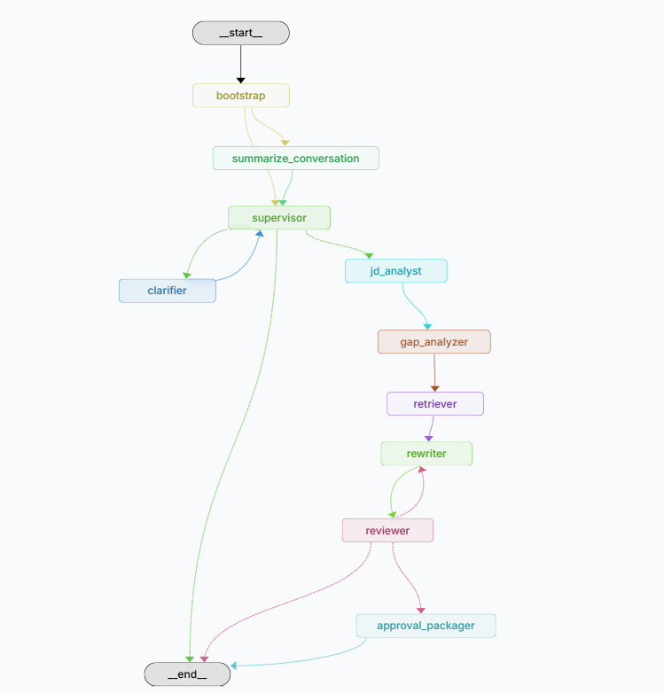

# AI Resume Forge - Python Backend

这是一个“标准 LangGraph 项目 + FastAPI 兼容入口”的 Python 后端。


目标不是单纯把目录拆多，而是让调试入口、业务入口、领域逻辑和基础设施边界清楚，方便长期维护。

## 双入口

- `langgraph dev`：加载 `langgraph.json`，用于 LangGraph Studio 图形化调试。
- `uvicorn src.app.main:app --reload`：保留 FastAPI，给 Java 后端调用。

## 目录分层

```text
python-backend/
├── langgraph.json              # LangGraph Studio 官方入口配置
├── pyproject.toml              # Python 项目元数据、依赖、测试和 lint 配置
├── src/
│   ├── agent/                  # 标准 LangGraph 包入口，保持薄封装
│   │   └── graph.py            # 导出 graph，给 langgraph.json 使用
│   └── app/
│       ├── agent/              # Agent 真实业务实现
│       │   ├── graph.py        # LangGraph 编排和 FastAPI SSE 适配
│       │   ├── state.py        # Input / Output / State
│       │   ├── nodes/          # 业务节点
│       │   ├── tools/          # Agent 工具适配
│       │   └── prompts/        # Prompt 分层
│       ├── service/            # 基础服务：Java、Redis、LLM、向量库
│       ├── internal_controller/# Java 内部调用入口
│       ├── internal_dto/       # Java/Python 内部契约
│       ├── controller/         # 健康检查等轻量 HTTP 入口
│       ├── dto/                # 通用 DTO
│       └── main.py             # FastAPI 应用入口
└── tests/
    └── unit_tests/             # 单元测试
```

## LangGraph Studio

```bash
cd python-backend
E:\develop\Anaconda\envs\codex-python\Scripts\python.exe -m pip install -e ".[dev]"
langgraph dev --no-browser --port 2024
```

Studio 加载的图：

```text
src/agent/graph.py:graph
```

`langgraph dev` 使用 `.env.langgraph`，避免读取本地 `.env` 时受到中文注释或系统编码影响。

Studio 的 `Input` 面板只保留最小运行输入，完整中间状态仍在 `ResumeAgentState` 内部流转。

## FastAPI

```bash
cd python-backend
uvicorn src.app.main:app --reload --port 8000
```

内部 Agent 接口：

- `POST /internal/graph/runs/stream`
- `POST /internal/graph/runs/{run_id}/continue/stream`
- `POST /internal/graph/runs/{run_id}/cancel`

## Checkpoint

Agent 等待态 checkpoint 使用 Redis：

- 默认连接：`redis://localhost:6379/0`
- key 格式：`agent:checkpoint:{run_id}`
- 用途：保存 `WAITING_USER` / `WAITING_CONFIRM` 状态，支持 continue 恢复。

## 记忆摘要

`ResumeAgentState` 继承 `MessagesState`，并额外维护 `summary`：

- `messages`：保留最近几轮原始消息，方便 LangGraph Studio Chat 和节点 Agent 读取上下文。
- `summary`：当消息数超过阈值时，由 `summarize_conversation` 节点把旧消息压缩成长期摘要。
- 阈值配置：`AGENT_SUMMARY_TRIGGER_MESSAGE_COUNT`，默认 `12`。
- 保留最近消息数：`AGENT_SUMMARY_KEEP_RECENT_MESSAGES`，默认 `6`。

## MCP Server

简历业务域 MCP Server 入口：

```bash
cd python-backend
python -m src.app.agent.mcp.resume_domain_mcp
```

当前暴露的工具：

- `load_resume_context`
- `validate_patch`
- `preview_patch`
- `persist_run_events`
- `update_run_status`

这些工具内部仍然复用 `JavaGatewayService`，不会绕过 Java 业务网关。

## 当前图结构

```text
bootstrap
  -> summarize_conversation
  -> supervisor
    -> clarifier -> END
    -> jd_analyst -> gap_analyzer -> retriever -> rewriter -> reviewer
      -> rewriter
      -> approval_packager -> END
      -> END
```

## 测试

```bash
cd python-backend
pytest
```

单元测试会 mock checkpoint，避免依赖 Redis。
